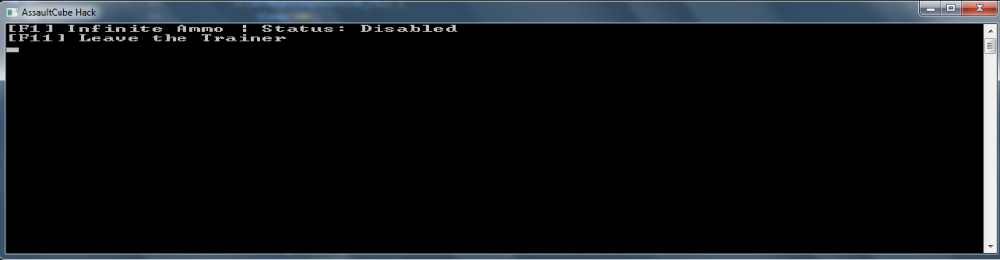
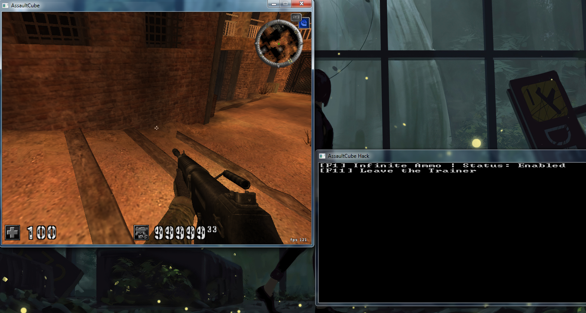

# Program
   
   
# Informations 
 > External trainer developed in c++ for a game AssaultCube using the function `WriteProcessMemory` to touch the memory.

# How to Use
 - The "F1" key activates and deactivates the infinite ammo option.
 - The "F12" key exit the program.

# LICENCE
- [MIT](https://github.com/sickog0d/ACTrainer/blob/main/LICENSE)
